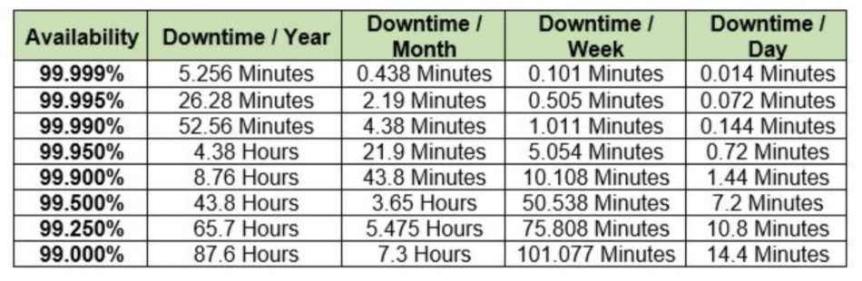

# Designing Highly Available, Cost-efficient, Fault-tolerant and Scalable Systems

## Availability
The percentage of time for which a system is made available is reffered as the availability of that System.
- Eg: If a system is available 12 hrs in day, then the availabilty of that system is 50%.
- Daily Availability, Weekly, Monthly or Yearly Avaibility is not the same thing even if the number is same.
- Best way to build higly available system is by using Muti-AZ Setup.

## Reliability
Reliability is the likelihood that a system will remain operational (despite of failures) i,e ability to tolerate failure.
- Higher the Reliability, System will be more fault-tolerant
- Multi-AZ and Multi Region setup are the quickest way to attain fault tolerant system within AWS.

## Scalable System
The system can be scale itself on the basis of load or stress is called scalable system and the process is called scaling.
- There are two types of Scaling:
	**1. Vertical Scaling:**
	This type of scaling is performed by increasing the capacity of the underlying System. i.e. By adding more memory (RAM), CPU to the existing System under load.
	**2. Horizontal Scaling** 
	This type of Scaling is perfomed by adding number of machine serving the load, so the load can be distributed among several machines so each machine experience proportionate amount of load that it can handle efficiently. Eg: Distributing traffic over two EC2 Instances rather than single one by routing traffic through loadbalancer using Round Robbin Algorithm.
	
- Both Type of scaling can be used wisely depending upon the use-case to design scalable Systems.

## Desiging Cost-efficient System
Every AWS service used costs money in way or the other. Many DevOps, Developers, and IT Professionals slip on the cost factor when they are designing the Highly Available, Reliable and Scalable Systems. 
- You can only spend a fraction of money on your infrastructure that your business can afford.
- There are multiple strategies to Design cost-effective solutions and to monitor the cost usage.
	1. Use Spot Instances for Test/Dev Loads
	2. Use Reserved Instances when the resource is to be used for a longer time without upgrades.
	3. Monitor for cost usage using cost allocation tags.
	4. Stop/Terminate Resources that you no longer intend to use.
	5. Prefer serverless solutions overself-manged ones.
	6. Right-Sizing the Resources.
	7. Use Scheduled Autoscaling for serving peak load instead of always sizing the resource to handle peak load.

## Best Practises
- Design the system to have no single point of failure.
- Use automated monitoring, failure detection, and failover mechanisms
- Correctly instrument and test system availability.
- Prepare operating procedures (Playbooks) for manual mechanisms to respond to, mitigate, and recover from the failure.

## Useful Links
- [AWS WhitePaper - Architecting for high availability](https://docs.aws.amazon.com/whitepapers/latest/oracle-database-aws-best-practices/architecting-for-high-availability.html)
- [AWS High Availability & Fault Tolerance Architecture](https://jayendrapatil.com/aws-high-availability-fault-tolerance-architecture-certification/)
- [AWS Blog - Architecting for Reliable Scalability](https://aws.amazon.com/blogs/architecture/architecting-for-reliable-scalability/)
- [AWS Blog - 10 things you can do today to reduce AWS costs](https://aws.amazon.com/blogs/compute/10-things-you-can-do-today-to-reduce-aws-costs/)
- [AWS Cost Optimization Best Practices](https://aws.amazon.com/aws-cost-management/aws-cost-optimization/)
