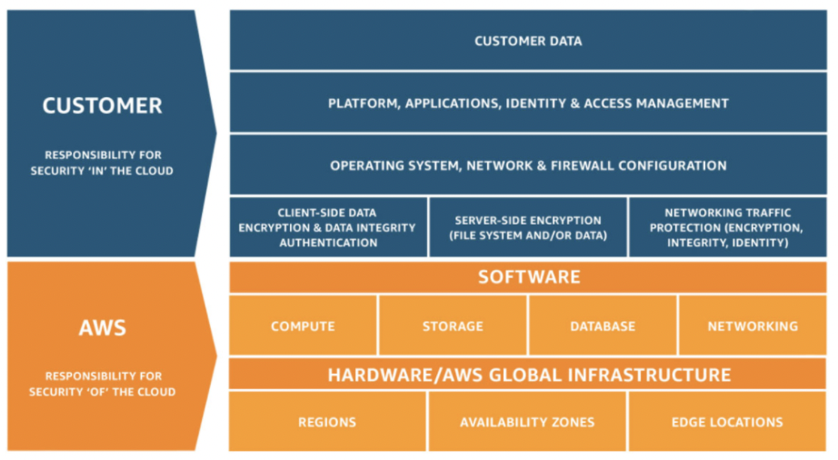

# Security Identity and Compliance

## Shared Responsibility Model


## Identity and Management (IAM)
[](https://www.youtube.com/watch?v=Ul6FW4UANGc)

- A Web service that helps us securely control access to AWS resources. 
- It enables us to create and manage AWS users and groups, and use permissions to allow and deny their access to AWS resources. 
- Control who is authenticated (signed in) and authorized (has permissions) to use resources.
- IAM is offered at no additional charge.

### Features of IAM
- Centralized control of AWS account
- Shared access to other AWS account
- Granular permissions
- Identity Federation
- Multi-Factor Authentication
- Temporary access for users or applications
- Password Rotation Policy

### IAM Users
- An entity that we create in AWS to represent the person or application that uses it to interact with AWS.
- The information used for creating users is used for **Authentication.**
- Users can access AWS in different ways depending on credentials.
	- Console Password
	- Access Keys
	- SSH keys for use with CodeCommit
	- Server Certificates (SSL/TLS certificates)
#### Types of IAM Users
**1. Root User:** 
- Email we use when creating an AWS account
**2. IAM User:** 
- Instead of sharing root credentials, we create individual IAM users which  has their own password.
- Users can have access keys for programmatic access.
**3. Federated User:**
- Allow users who already have passwords elsewhere
- Identities from Corporate Directory or OpenID providers

### IAM Groups
- Collection of IAM users.
- Groups let us specify permissions for multiple users that are in a single group by attaching the permission policies to the group instead of individual users.
- A group can contain many users, and a user can belong to multiple groups.
- Groups cannot be nested.

### IAM Policies
- An entity that, when attached to an identity (users, Groups, Roles etc.) or resource (EC2, instances, S3 Buckets etc), defines their permissions.
- This feature **authorizes** the authenticated user to perform allowed actions within AWS.
- AWS evaluates these policies when a principal entity (user or role) makes a request.
- IAM's Policy Evaluation Logic denies all requests by default, so successful actions/operations have to be explicitly allowed by the admin within the user and resource policies.
- An explicit allow in policy overrides the default deny but cannot overrides explicit deny.

An Example of IAM Policy:
```JSON
{
    "Version": "2012-10-17",
    "Statement": [
        {
            "Sid": "AllowS3ListRead",
            "Effect": "Allow",
            "Action": [
                "s3:GetBucketLocation",
                "s3:GetAccountPublicAccessBlock",
                "s3:ListAccessPoints",
                "s3:ListAllMyBuckets"
            ],
            "Resource": "arn:aws:s3:::*"
        },
        {
            "Sid": "AllowS3Self",
            "Effect": "Allow",
            "Action": "s3:*",
            "Resource": [
                "arn:aws:s3:::carlossalazar/*",
                "arn:aws:s3:::carlossalazar"
            ]
        },
        {
            "Sid": "DenyS3Logs",
            "Effect": "Deny",
            "Action": "s3:*",
            "Resource": "arn:aws:s3:::*log*"
        }
    ]
}
```

#### Types of IAM Policies
**1. Identity-based policies:**
- It is attached to an IAM user, group, or role.
- Types of identity-based policies are:
	**a. AWS Managed Policies**
	- Standalone policy that is created and administered by AWS.
	- Designed to provide permissions for many common use cases.
	
	**b. Customer Managed Policies**
	- Standalone policies that we administer in our own AWS account.
	- We can edit customer managed policies unlike AWS managed policies

	**c. Inline Policies**
	- Policy that’s embedded in a particular user, group or role
	- Useful to maintain a strict one-to-one relationship between policy and a particular entity.
	- If an entity(which contains an inline policy) is deleted, then inline policy is automatically deleted.

	**d. Job Function Policy**
	- AWS managed policies
	- Designed to closely align to common job functions in the IT industry
	- Consolidate permissions for many services into a single policy
	- Job Functions like DatabaseAdministrator, NetworkAdministrator, SystemAdministrator etc.

**2. Resource-based Policy**
- Resource-based policies are attached to a resource.
- We can attach resource-based policies to Amazon S3 buckets or an IAM Role trust policy.
- Resource based policies are inline only, not managed.

#### Policy Evaulation Logic


### IAM Roles
- IAM identity that has specific set of permissions.
- Similar to users
- Intended to be assumable by anyone who needs it.
- When you assume a role, it provides you with temporary security credentials for your role session.
- Two ways to use a role:
	- Interactively in the IAM console
	- Programmatically with the AWS CLI or AWS API. 
	- Also _Granting Permissions to Pass a Role to a Service: pass role_

- Common scenarios for which we will use IAM Roles
	1. Providing Access to an AWS Service
	2. Providing Access Across AWS Accounts
	3. Providing Access to Third-Party AWS Accounts
	4. Providing Access Through Identity Federation

**1. Providing Access to an AWS Service**
- Allows AWS Services to perform actions on our behalf. 
- Also called service roles .
- Role that a service assumes to perform action on our behalf.

**2. Providing Access Across AWS Accounts**
- Allows entities in other accounts to perform actions in our account. 
- With these roles, we can establish a trust relationships between our trusting account and other AWS trusted accounts.
- The trusting account owns the resource to be accessed and trusted account contains the users.

**3. Providing Access Through Identity Federation**
- Use IAM identity providers instead of creating IAM users.
- Allows users federated by specified external web identity (such as Facebook, Google) or OpenID Connect(OIDC) compatible IdP or SAML 2.0  based IdP to assume the role.
- Useful to create a mobile app or web application that requires access to AWS resources.

### IAM Best Practises
- Create Individual Users, avoid using root credentials
- Grant Minimum Privileges
- Manage Permissions with Groups
- Restrict Privileged access further with conditions
- Configure a strong password policy
- Rotate Security Credentials Regularly
- Enable MFA for privileged users
- Use IAM roles to share access

## Fundamentals of Encryption
Encryption is a means of securing digital data using one or more mathematical techniques, along with a password or "key" used to decrypt the information.
- There are two types of encryption keys
	1. Symetric Keys
	2.  Asymetric Keys
- Encryption enhances the security of a message or file by scrambling the content.
- To encrypt a message, you need the right key, and you need the right key to decrypt it as well.

## AWS Certificate Manager (ACM)
- ACM enables us to easily provision, manage, deploy, and renew SSL/TLS certificates. 
- Public SSL/TLS certificates provisioned through AWS Certificate Manager are free. You pay only for the AWS resources you create to run your application.
- You can either generate certificates within AWS or import existing certificates that you generate with other CAs like Digicert. This will require you to validate that you own the domain/subdomain for which you are generating the certificates. The available method for Domain Validation for ACM are:
	- DNS validation (You will need to add an entry to you DNS records to verify that you own the domain).
	- Email Validation (You will need to provide an email address that you own among administrator/hostmaster/postmaster/webmasteradmin@your_domain_name. You can also use any of the 3 emails which are registered in the WHOIS database for your domain.

### Benefits and Features of Using ACM
**1. Free public certificates for ACM-integrated services** 
**2. Managed certificate renewal:**
- The validity period for ACM certificates is 13 months (395 days). 
- ACM will automatically renew the SSL/TLS for Amazon issued certificates before the expiration.
**3. Easy to get an SSL/TLS certificate:**
There is no need to generate a key and Certificate Signing Reques (CSR). After creating certificate, ACM takes care of deploying certificates to help you enable SSL/TLS for your website or application.

### Things you cannot do with ACM:
- You cannot download the ACM certificate. It has to be attached within AWS resources like Elastic Loadbalancer, Cloudfront Distribution only.
- You cannot use ACM for websites/applications hosted with Virtual Hosts inside EC2 instances.
- ACM wildcard Certificates ( eg: *.example.com) will only work for one subdomain level (eg: staging.example.com) and does not work for multi level subdomains (eg: login.staging.example.com).
- A wildcard certificate (eg: *.example.com) can only be used with subdomains of _example.com_ (eg: staging.example.com and test.example.com) and not for the domain apex (eg: _example.com_) itself . i.e. You should generate a separate certificate for staging.example.com and example.com even if you are using wildcard certificates generated by ACM.

## Key Management Service (KMS)
- AWS KMS enables you to centrally manage and securely store your encryption keys.
- You can generate keys in AWS KMS or import them from your own key management infrastructure. 
- You can set usage policies that determine which users can use your keys and what actions they can perform with KMS policy.
- All requests to use these keys are logged in AWS CloudTrail so that you can track who used which key, how and when.

### Benefits and Feature
1. Fully managed
2. Centralized key management
3. Integrated with AWS services (Eg: Databases, cloudwatch, Streams etc.)
4. Built-in auditing
5. Secure
6. Encryption for all your applications
7. No commitment
8. Reliable

## Useful Services for Self Study
- AWS Secrets Manager
- WAF & Shield

## Useful Links
- [AWS Docs - Understanding how IAM works](https://docs.aws.amazon.com/IAM/latest/UserGuide/intro-structure.html)
- [AWS Docs - Security features outside IAM](https://docs.aws.amazon.com/IAM/latest/UserGuide/introduction_security-outside-iam.html)
- [Troubleshooting general IAM issues](https://docs.aws.amazon.com/IAM/latest/UserGuide/troubleshoot_general.html)
- [AWSDocs - Security best practices in IAM](https://docs.aws.amazon.com/IAM/latest/UserGuide/best-practices.html)
- [AWSDocs - ACM Certifiacte Characteristics](https://docs.aws.amazon.com/acm/latest/userguide/acm-certificate.html)
- [AWSPricing - KMS](https://aws.amazon.com/kms/pricing/)


## Lab Tasks
### IAM
1. Create a group named as `DevOps`
2. Create a user `smriti.tiwari`. The user should have AWS console access only.
3. The group DevOps should be able to perform following actions:
	a. EC2 full access
	b. RDS Full Access
4. Login into AWS Management console and check the permissions for user `smriti.tiwari` and try to List S3 buckets. Does it fail with permission issue. Why?
5. Logout from the user `smriti.tiwari`
6. Login again as the previliged user (this can be  `root` or `admin` ) and add full permission to S3 bucket for `DevOps` group.
7. Create a policy names as `S3BucketAccessPolicy` and add the following permission
	a. S3 Full access
9. Attach this policy to `DevOps` Group.
10. Now again login from `smriti.tiwari` group and try to create a S3 bucket. Creating a S3 bucket doesnot incur any cost. If you upload any object (file) in that bucket that would cost you some $.
11. Create a EC2 instance with name `AWS Training` SSH into the EC2 instance and try to list all S3 buckets from the EC2 instance.
Hint:
```bash
aws s3 ls
```
13. Again login as privileged user and create a Role `S3AccessRole`. Attach `S3BucketAccessPolicy` to that role.
14. Attach `S3AccessRole` to the EC2 instance.
15. Try SSH-ing in to the EC2 instance and again try to list all S3 buckets from the EC2 instance. Does it Fail or pass and Why ?
16. Change the password policy to adhere to following rules:
	a. Minimum password length: 12
	b. Must Contain atleast a LowerCase, UpperCase, Number and Special Character.
	c. User must rotate the password atleast every 30 days
17. Now Login as `smriti.tiwari` and change the password for the that user. If user fails to change the password. Add specific permissions by logging in as privileged user?

Cleanup
- Delete group `DevOps`
- Delete the user `smriti.tiwari`
- Delete S3 Bucket `smriti123`
- Delete EC2 instance
- Delete the IAM policy `S3BucketAccessPolicy`
- Revert Password Policy to as it was earlier.

If you Completed the following Tasks, then give a virtual Hi-five !


### ACM and KMS
We will do the labs for ACM and KMS on other chapters as it needs to interact with other services like Elastic Loadbalancer, Cloudfront, RDS, Dynamodb, S3, Kinesis Streams etc.
